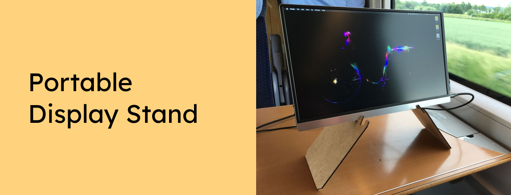

Do you have a portable external display, but want to use it in a more healthy position? Just lasercut this free stand!

Want to support the development and stay updated?

 

## Instrutions

Lasercut the two display stand sides on 3mm thick MDF and use two small cablebinder to connect the stand.